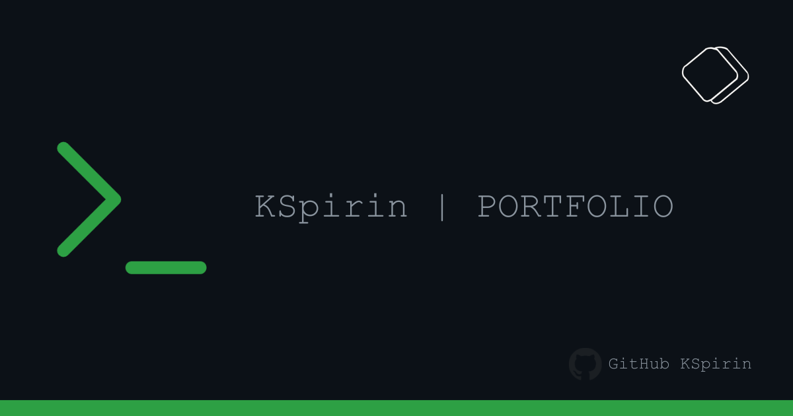

# Portfolio

A terminal-themed portfolio site with GitHub API integration.

## Features

- **Boot Simulation**: A JavaScript-driven boot sequence on page load.
- **GitHub Integration**: Fetches public repo count and recent activity via the GitHub API.
- **Interactive Logs**: Hovering over the "About" section toggles between the MOTD and a recent activity log.
- **Uptime Counter**: A live timer showing seconds since the page was opened.
- **Theme Toggling**: Switch between Dark and Light (Pink-themed) modes via the system status bar.
- **SEO Ready**: Includes Open Graph and Meta tags for social media previews.

## Tech Stack

- **HTML5/CSS3**: Custom terminal theme and layout.
- **JavaScript**: Handles the boot sequence, API calls, and UI animations.

## Directory Structure

- `index.html`: Main structure and meta tags.
- `style.css`: Terminal styling and hover transitions.
- `script.js`: Logic for fetching data and system effects.
- `img/`: Assets including `favicon.ico` and `preview.png`.

## License

MIT License - see [LICENSE](LICENSE) for details.
